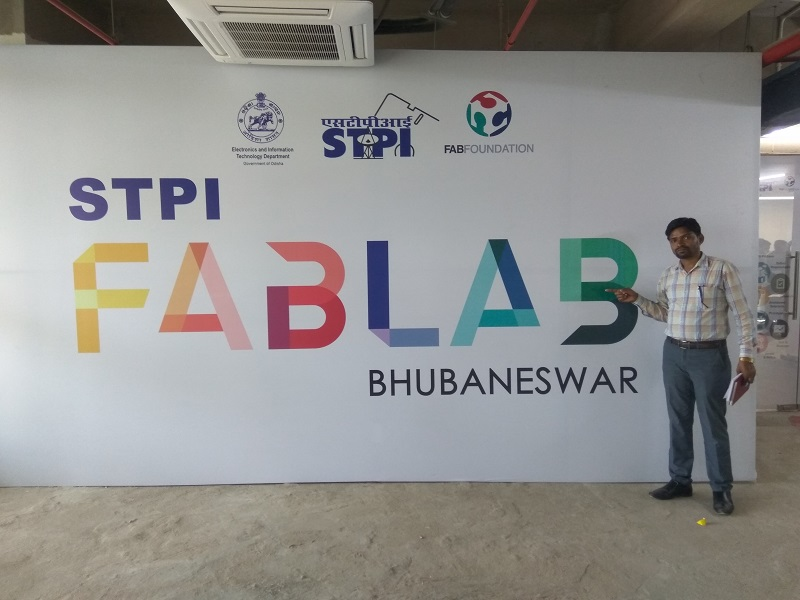

# Day 1 Training of Fab Lab.
 There is two spaces in the fab lab.
 i) learning space
 ii) Loud and machine space. CNC Machine(shop bot).
 CNC machine has 3 axis.
  There are various machines installed in the fab lab.
  i) Dust collector(Shopfox)
  ii) Vinyle cutter(Roland)
  iii) CO2 Laser cutter(EPILOG)
  iv) Smaller CNC machine and electronics equipments.
  v) Micro Ovan
  vi) Ultra violet machine.
  Object 3D machine.
  vii) Inkjet printer.

  
